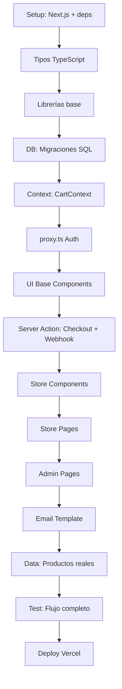

# Arid Store — Especificación Técnica

> Basado en el PRD v1.0 — MVP Tienda Poleras Estampadas
> Stack: Next.js 16 App Router · Supabase · Vercel · MercadoPago · Resend

---

## Índice

- [1. Arquitectura y decisiones técnicas](#1-arquitectura-y-decisiones-técnicas)
- [2. Estructura del proyecto](#2-estructura-del-proyecto)
- [3. Tipos TypeScript](#3-tipos-typescript)
- [4. Base de datos (Supabase)](#4-base-de-datos-supabase)
- [5. Librerías base](#5-librerías-base)
- [6. proxy.ts — Autenticación (Next.js 16)](#6-proxysts--autenticación-nextjs-16)
- [7. CartContext](#7-cartcontext)
- [8. API Routes + Server Actions](#8-api-routes--server-actions)
- [9. Páginas y componentes](#9-páginas-y-componentes)
- [10. Orden de ejecución](#10-orden-de-ejecución)
- [11. Criterios de aceptación](#11-criterios-de-aceptación)

---

## 1. Arquitectura y decisiones técnicas

### Stack

| Capa | Tecnología | Versión |
|------|-----------|---------|
| Framework | Next.js App Router | 16.2.6 |
| Estilos | Tailwind CSS | 4 |
| Componentes base | Radix UI | latest |
| Base de datos + Auth + Storage | Supabase | latest client |
| Pagos | MercadoPago SDK Node | latest |
| Email | Resend + React Email | latest |
| Despliegue | Vercel | — |

### Decisiones fijas

#### Imágenes de producto
Se almacenan en Supabase Storage (bucket público `product-images`). Se sirven usando la API de transformación de Supabase directamente, sin pasar por el pipeline de Image Optimization de Next.js.

**Motivo:** El plan gratuito de Vercel limita a 1.000 imágenes optimizadas por mes; Supabase Storage tiene CDN propio (Cloudflare) con transformaciones por URL que no consumen ese cupo.

URL de imagen transformada:
```
https://{SUPABASE_URL}/storage/v1/render/image/public/product-images/{path}?width=800&quality=80&format=webp
```

Cuando se use `next/image` con imágenes de producto, siempre con `unoptimized={true}`. Para thumbnails en admin se puede usar `` estándar directamente.

#### Precios
Siempre enteros en CLP. Sin decimales en ninguna capa. No usar `parseFloat` para dinero.

#### Claves secretas
`SUPABASE_SERVICE_ROLE_KEY` y `MP_ACCESS_TOKEN` nunca se importan en archivos que contengan `"use client"` ni en archivos bajo `app/(store)/`. Solo en Route Handlers (`app/api/`) y Server Actions (`lib/actions/`).

#### Webhook
Siempre retorna HTTP 200, incluso si hay error interno. Los errores se loguean con `console.error` pero no se propagan como respuesta.

---

## 2. Estructura del proyecto

```
/
├── app/
│   ├── (store)/
│   │   ├── layout.tsx
│   │   ├── page.tsx                    # Home
│   │   ├── productos/
│   │   │   └── page.tsx                # Catálogo
│   │   ├── producto/
│   │   │   └── [slug]/
│   │   │       └── page.tsx            # Detalle producto
│   │   ├── carrito/
│   │   │   └── page.tsx
│   │   └── checkout/
│   │       ├── page.tsx
│   │       └── resultado/
│   │           └── page.tsx
│   ├── (admin)/
│   │   ├── layout.tsx
│   │   ├── admin/
│   │   │   ├── page.tsx               # Dashboard
│   │   │   ├── productos/
│   │   │   │   ├── page.tsx
│   │   │   │   ├── nuevo/
│   │   │   │   │   └── page.tsx
│   │   │   │   └── [id]/
│   │   │   │       └── page.tsx
│   │   │   └── pedidos/
│   │   │       ├── page.tsx
│   │   │       └── [id]/
│   │   │           └── page.tsx
│   │   └── login/
│   │       └── page.tsx
│   └── api/
│       └── webhooks/
│           └── mercadopago/
│               └── route.ts
├── components/
│   ├── store/
│   │   ├── ProductCard.tsx
│   │   ├── ProductGallery.tsx
│   │   ├── VariantSelector.tsx
│   │   ├── AddToCartButton.tsx
│   │   ├── CartDrawer.tsx
│   │   ├── CartItem.tsx
│   │   └── CheckoutForm.tsx
│   ├── admin/
│   │   ├── ProductForm.tsx
│   │   ├── OrdersTable.tsx
│   │   ├── OrderStatusBadge.tsx
│   │   └── StatsCard.tsx
│   └── ui/
│       ├── Button.tsx
│       ├── Input.tsx
│       ├── Select.tsx
│       ├── Badge.tsx
│       └── Dialog.tsx
├── context/
│   └── CartContext.tsx
├── lib/
│   ├── actions/
│   │   └── checkout.ts
│   ├── supabase/
│   │   ├── client.ts
│   │   └── server.ts
│   ├── mercadopago.ts
│   ├── resend.ts
│   ├── images.ts
│   └── utils.ts
├── types/
│   └── index.ts
├── emails/
│   └── OrderConfirmation.tsx
├── proxy.ts
└── docs/
    └── SPEC.md
```

---

## 3. Tipos TypeScript

Definiciones centralizadas en `types/index.ts`:

```typescript
export type Product = {
  id: string
  slug: string
  name: string
  description: string | null
  base_price: number           // CLP entero
  is_active: boolean
  created_at: string
  updated_at: string
  variants?: ProductVariant[]
  images?: ProductImage[]
}

export type ProductVariant = {
  id: string
  product_id: string
  size: 'XS' | 'S' | 'M' | 'L' | 'XL' | 'XXL'
  color: string                // nombre legible: "Negro"
  color_hex: string | null     // "#1a1a1a"
  stock: number
  sku: string | null
  price_override: number | null
  created_at: string
}

export type ProductImage = {
  id: string
  product_id: string
  variant_id: string | null
  storage_path: string
  alt_text: string | null
  sort_order: number
  is_primary: boolean
}

export type CartItem = {
  variantId: string
  productName: string
  variantDesc: string          // "Talla L - Negro"
  price: number                // CLP entero, snapshot al añadir
  quantity: number
  imageUrl: string
  slug: string
}

export type OrderStatus =
  | 'pending'
  | 'approved'
  | 'rejected'
  | 'cancelled'
  | 'shipped'
  | 'delivered'

export type ShippingAddress = {
  street: string
  city: string
  region: string
  zip: string | null
  notes: string | null
}

export type Order = {
  id: string
  status: OrderStatus
  mp_preference_id: string | null
  mp_payment_id: string | null
  total_amount: number
  customer_email: string
  customer_name: string
  customer_phone: string | null
  shipping_address: ShippingAddress
  metadata: Record<string, unknown>
  created_at: string
  updated_at: string
  items?: OrderItem[]
}

export type OrderItem = {
  id: string
  order_id: string
  variant_id: string
  product_name: string
  variant_desc: string
  unit_price: number
  quantity: number
}

export type CheckoutPayload = {
  items: Array<{
    variantId: string
    quantity: number
  }>
  customer: {
    name: string
    email: string
    phone: string
    address: ShippingAddress
  }
}

export type CheckoutResponse =
  | { preferenceId: string; initPoint: string }
  | { error: 'INSUFFICIENT_STOCK'; failedItems: string[] }
  | { error: 'VALIDATION_ERROR'; message: string }
```

---

## 4. Base de datos (Supabase)

### Migración 001 — Tablas base

```sql
-- products
CREATE TABLE products (
  id          UUID PRIMARY KEY DEFAULT gen_random_uuid(),
  slug        TEXT UNIQUE NOT NULL,
  name        TEXT NOT NULL,
  description TEXT,
  base_price  INTEGER NOT NULL CHECK (base_price > 0),
  is_active   BOOLEAN DEFAULT true,
  created_at  TIMESTAMPTZ DEFAULT NOW(),
  updated_at  TIMESTAMPTZ DEFAULT NOW()
);

-- product_variants
CREATE TABLE product_variants (
  id             UUID PRIMARY KEY DEFAULT gen_random_uuid(),
  product_id     UUID NOT NULL REFERENCES products(id) ON DELETE CASCADE,
  size           TEXT NOT NULL CHECK (size IN ('XS','S','M','L','XL','XXL')),
  color          TEXT NOT NULL,
  color_hex      TEXT,
  stock          INTEGER NOT NULL DEFAULT 0 CHECK (stock >= 0),
  sku            TEXT UNIQUE,
  price_override INTEGER CHECK (price_override > 0),
  created_at     TIMESTAMPTZ DEFAULT NOW()
);

-- product_images
CREATE TABLE product_images (
  id           UUID PRIMARY KEY DEFAULT gen_random_uuid(),
  product_id   UUID NOT NULL REFERENCES products(id) ON DELETE CASCADE,
  variant_id   UUID REFERENCES product_variants(id) ON DELETE SET NULL,
  storage_path TEXT NOT NULL,
  alt_text     TEXT,
  sort_order   INTEGER DEFAULT 0,
  is_primary   BOOLEAN DEFAULT false
);

-- orders
CREATE TABLE orders (
  id                UUID PRIMARY KEY DEFAULT gen_random_uuid(),
  status            TEXT NOT NULL DEFAULT 'pending'
                    CHECK (status IN ('pending','approved','rejected','cancelled','shipped','delivered')),
  mp_preference_id  TEXT,
  mp_payment_id     TEXT,
  total_amount      INTEGER NOT NULL CHECK (total_amount > 0),
  customer_email    TEXT NOT NULL,
  customer_name     TEXT NOT NULL,
  customer_phone    TEXT,
  shipping_address  JSONB NOT NULL,
  metadata          JSONB DEFAULT '{}',
  created_at        TIMESTAMPTZ DEFAULT NOW(),
  updated_at        TIMESTAMPTZ DEFAULT NOW()
);

-- order_items
CREATE TABLE order_items (
  id           UUID PRIMARY KEY DEFAULT gen_random_uuid(),
  order_id     UUID NOT NULL REFERENCES orders(id) ON DELETE CASCADE,
  variant_id   UUID NOT NULL REFERENCES product_variants(id),
  product_name TEXT NOT NULL,
  variant_desc TEXT NOT NULL,
  unit_price   INTEGER NOT NULL CHECK (unit_price > 0),
  quantity     INTEGER NOT NULL DEFAULT 1 CHECK (quantity > 0)
);

-- trigger updated_at automático
CREATE OR REPLACE FUNCTION update_updated_at()
RETURNS TRIGGER AS $$
BEGIN NEW.updated_at = NOW(); RETURN NEW; END;
$$ LANGUAGE plpgsql;

CREATE TRIGGER products_updated_at
  BEFORE UPDATE ON products
  FOR EACH ROW EXECUTE FUNCTION update_updated_at();

CREATE TRIGGER orders_updated_at
  BEFORE UPDATE ON orders
  FOR EACH ROW EXECUTE FUNCTION update_updated_at();
```

### Migración 002 — Políticas RLS

```sql
ALTER TABLE products        ENABLE ROW LEVEL SECURITY;
ALTER TABLE product_variants ENABLE ROW LEVEL SECURITY;
ALTER TABLE product_images  ENABLE ROW LEVEL SECURITY;
ALTER TABLE orders          ENABLE ROW LEVEL SECURITY;
ALTER TABLE order_items     ENABLE ROW LEVEL SECURITY;

-- PRODUCTS: lectura pública de activos, escritura solo admin
CREATE POLICY "products_public_read"
  ON products FOR SELECT
  USING (is_active = true);

CREATE POLICY "products_admin_all"
  ON products FOR ALL
  USING (auth.jwt() ->> 'role' = 'admin')
  WITH CHECK (auth.jwt() ->> 'role' = 'admin');

-- PRODUCT_VARIANTS: lectura pública
CREATE POLICY "variants_public_read"
  ON product_variants FOR SELECT USING (true);

CREATE POLICY "variants_admin_all"
  ON product_variants FOR ALL
  USING (auth.jwt() ->> 'role' = 'admin')
  WITH CHECK (auth.jwt() ->> 'role' = 'admin');

-- PRODUCT_IMAGES: lectura pública
CREATE POLICY "images_public_read"
  ON product_images FOR SELECT USING (true);

CREATE POLICY "images_admin_all"
  ON product_images FOR ALL
  USING (auth.jwt() ->> 'role' = 'admin')
  WITH CHECK (auth.jwt() ->> 'role' = 'admin');

-- ORDERS: solo service_role escribe, admin lee todo
CREATE POLICY "orders_admin_read"
  ON orders FOR SELECT
  USING (auth.jwt() ->> 'role' = 'admin');

-- ORDER_ITEMS: solo service_role escribe, admin lee todo
CREATE POLICY "order_items_admin_read"
  ON order_items FOR SELECT
  USING (auth.jwt() ->> 'role' = 'admin');
```

### Migración 003 — Admin user

```sql
UPDATE auth.users
SET raw_app_meta_data = raw_app_meta_data || '{"role": "admin"}'
WHERE email = 'admin@tutienda.com';
```

### Storage — Bucket

```sql
INSERT INTO storage.buckets (id, name, public)
VALUES ('product-images', 'product-images', true);

CREATE POLICY "product_images_public_read"
  ON storage.objects FOR SELECT
  USING (bucket_id = 'product-images');

CREATE POLICY "product_images_admin_write"
  ON storage.objects FOR INSERT
  WITH CHECK (
    bucket_id = 'product-images'
    AND auth.jwt() ->> 'role' = 'admin'
  );

CREATE POLICY "product_images_admin_delete"
  ON storage.objects FOR DELETE
  USING (
    bucket_id = 'product-images'
    AND auth.jwt() ->> 'role' = 'admin'
  );
```

### Función RPC — Decremento seguro de stock

```sql
CREATE OR REPLACE FUNCTION decrement_stock(p_variant_id UUID, p_quantity INTEGER)
RETURNS void AS $$
BEGIN
  UPDATE product_variants
  SET stock = GREATEST(0, stock - p_quantity)
  WHERE id = p_variant_id AND stock >= p_quantity;

  IF NOT FOUND THEN
    RAISE EXCEPTION 'Stock insuficiente para variant %', p_variant_id;
  END IF;
END;
$$ LANGUAGE plpgsql SECURITY DEFINER;
```

---

## 5. Librerías base

### `lib/supabase/client.ts`

```typescript
import { createBrowserClient } from '@supabase/ssr'

export function createClient() {
  return createBrowserClient(
    process.env.NEXT_PUBLIC_SUPABASE_URL!,
    process.env.NEXT_PUBLIC_SUPABASE_PUBLISHABLE_KEY!
  )
}
```

### `lib/supabase/server.ts`

En Next.js 16, `cookies()` es asíncrono y requiere `await`.

```typescript
import { createServerClient as createSupabaseServerClient } from '@supabase/ssr'
import { cookies } from 'next/headers'

// Cliente con publishable key — para lectura en Server Components
export async function createServerClient() {
  const cookieStore = await cookies()
  return createSupabaseServerClient(
    process.env.NEXT_PUBLIC_SUPABASE_URL!,
    process.env.NEXT_PUBLIC_SUPABASE_PUBLISHABLE_KEY!,
    { cookies: { getAll: () => cookieStore.getAll() } }
  )
}

// Cliente con service_role — SOLO para Route Handlers y Server Actions
export function createAdminClient() {
  return createSupabaseServerClient(
    process.env.NEXT_PUBLIC_SUPABASE_URL!,
    process.env.SUPABASE_SERVICE_ROLE_KEY!,  // service_role bypasses RLS
    { cookies: { getAll: () => [] } }
  )
}
```

### `lib/actions/checkout.ts` — Server Action

Las Server Actions viven en `lib/actions/`. Cada archivo exporta funciones con `"use server"` que reciben `formData` y un `prevState` opcional para `useActionState`.

Patrón general:

```typescript
'use server'

import { z } from 'zod'

const schema = z.object({ /* ... */ })

export async function someAction(
  prevState: { error?: string; success?: boolean } | null,
  formData: FormData
) {
  const parsed = schema.safeParse(Object.fromEntries(formData))
  if (!parsed.success) return { error: 'Datos inválidos' }
  // ... lógica server ...
  return { success: true }
}
```

El cliente lo consume con `useActionState`:

```typescript
'use client'
import { useActionState } from 'react'
import { someAction } from '@/lib/actions/someAction'

const [state, formAction, pending] = useActionState(someAction, null)
```

### `lib/images.ts`

Centraliza la lógica de URLs de imágenes con transformaciones de Supabase Storage.

```typescript
const STORAGE_URL = process.env.NEXT_PUBLIC_SUPABASE_STORAGE_URL

export function getProductImageUrl(
  storagePath: string,
  options: ImageOptions = {}
): string { /* ... */ }

export const imagePresets = {
  thumbnail: (path: string) => getProductImageUrl(path, { width: 400, quality: 75 }),
  card:      (path: string) => getProductImageUrl(path, { width: 600, quality: 80 }),
  detail:    (path: string) => getProductImageUrl(path, { width: 900, quality: 85 }),
  adminThumb:(path: string) => getProductImageUrl(path, { width: 200, quality: 70 }),
}
```

### `lib/utils.ts`

```typescript
export function formatCLP(amount: number): string {
  return new Intl.NumberFormat('es-CL', {
    style: 'currency', currency: 'CLP', maximumFractionDigits: 0
  }).format(amount)
}

export function slugify(text: string): string { /* ... */ }
export function shortId(uuid: string): string { /* ... */ }
```

### `lib/mercadopago.ts`

Server-side only. Crea preferencias de pago en MercadoPago.

### `lib/resend.ts`

Server-side only. Envía emails de confirmación usando React Email templates.

---

## 6. proxy.ts — Autenticación (Next.js 16)

Next.js 16 renombró `middleware.ts` a `proxy.ts`. El archivo se coloca en la raíz del proyecto y exporta una función `proxy()` con la misma API que el antiguo `middleware()`.

`proxy.ts` protege todas las rutas bajo `/admin/*` (excepto `/admin/login`).

Verifica:
1. Sesión activa de Supabase Auth
2. `app_metadata.role === 'admin'`

Si no cumple, redirige a `/admin/login`.

### Referencia — `proxy.ts`

```typescript
import { createServerClient } from '@supabase/ssr'
import { NextResponse, type NextRequest } from 'next/server'

export async function proxy(request: NextRequest) {
  const { pathname } = request.nextUrl

  if (!pathname.startsWith('/admin') || pathname === '/admin/login') {
    return NextResponse.next()
  }

  const response = NextResponse.next()
  const supabase = createServerClient(/* ... */)
  const { data: { user } } = await supabase.auth.getUser()

  if (!user) return NextResponse.redirect(new URL('/admin/login', request.url))
  if (user.app_metadata?.role !== 'admin')
    return NextResponse.redirect(new URL('/', request.url))

  return response
}

export const config = { matcher: ['/admin/:path*'] }
```

---

## 7. CartContext

Contexto de carrito con `useReducer` + persistencia en `localStorage`:

| Acción | Descripción |
|--------|-------------|
| ADD_ITEM | Agrega item o incrementa cantidad si ya existe |
| REMOVE_ITEM | Elimina item del carrito |
| UPDATE_QUANTITY | Cambia cantidad (elimina si ≤ 0) |
| CLEAR_CART | Vacía el carrito |
| LOAD_FROM_STORAGE | Restaura desde localStorage al montar |

Clave de storage: `cart_v1`

---

## 8. API Routes + Server Actions

### `lib/actions/checkout.ts` — Server Action (Next.js 16)

Next.js 16 favorece Server Actions sobre Route Handlers para operaciones de escritura. El checkout se implementa como una Server Action con `"use server"`.

**Patrón Server Action con `useActionState`:**

```typescript
'use server'

import { createAdminClient } from '@/lib/supabase/server'
import { createPreference } from '@/lib/mercadopago'
import type { CheckoutPayload, CheckoutResponse } from '@/types'

export async function checkoutAction(
  prevState: CheckoutResponse | null,
  formData: FormData
): Promise<CheckoutResponse> {
  const payload: CheckoutPayload = {
    items: JSON.parse(formData.get('items') as string),
    customer: JSON.parse(formData.get('customer') as string),
  }
  // ... mismo flujo que el antiguo Route Handler ...
}
```

Flujo:
1. Validar payload (`CheckoutPayload`) con Zod
2. Leer variantes desde Supabase con stock
3. Verificar stock suficiente
4. Crear orden en `orders` con status `pending`
5. Insertar `order_items`
6. Crear preferencia en MercadoPago
7. Guardar `mp_preference_id` en la orden
8. Retornar `{ preferenceId, initPoint }`

### `POST /api/webhooks/mercadopago` — Route Handler

Flujo:
1. Recibir notificación de MercadoPago
2. Consultar payment en API de MP
3. Validar idempotencia
4. Actualizar estado de la orden
5. Si `approved`: descontar stock + enviar email de confirmación
6. Siempre retorna 200

---

## 9. Páginas y componentes

### Store (público)

| Ruta | Componente | Tipo | Descripción |
|------|-----------|------|-------------|
| `/` | Home | Server | Hero + últimos 4 productos |
| `/productos` | Catálogo | Server | Todos los productos activos |
| `/producto/[slug]` | Detalle | Server + Client | Galería, variantes, add to cart |
| `/carrito` | Carrito | Client | Items del carrito |
| `/checkout` | Checkout | Client | `useActionState` + Server Action → MP redirect |
| `/checkout/resultado` | Resultado | Client | Post-pago (éxito/error) |

### Admin (protegido)

| Ruta | Componente | Descripción |
|------|-----------|-------------|
| `/admin` | Dashboard | Stats: pedidos del día, ventas mes, pendientes, stock bajo |
| `/admin/productos` | Lista | Tabla de productos con toggle activo |
| `/admin/productos/nuevo` | Form | `useActionState` + Server Action, Zod validation |
| `/admin/productos/[id]` | Form | `useActionState` + Server Action, Zod validation |
| `/admin/pedidos` | Lista | Tabla de pedidos con filtro por estado |
| `/admin/pedidos/[id]` | Detalle | Info cliente, items, cambiar estado |
| `/admin/login` | Login | Autenticación admin — protegido por `proxy.ts` |

### Componentes base (UI)

`Button`, `Input`, `Select`, `Badge`, `Dialog` — construidos con Radix UI + Tailwind.

---

## 10. Orden de ejecución



Orden detallado:

| # | Fase | Tarea |
|---|------|-------|
| 1 | SETUP | Crear proyecto, instalar deps, configurar Tailwind 4 y Radix UI |
| 2 | SETUP | Configurar `.env.local` |
| 3 | SETUP | Crear estructura de directorios |
| 4 | TIPOS | Implementar `types/index.ts` |
| 5 | LIB | Implementar `lib/supabase/client.ts` y `server.ts` |
| 6 | LIB | Implementar `images.ts`, `utils.ts`, `mercadopago.ts`, `resend.ts` |
| 7 | DB | Migraciones: tablas → RLS → Storage → función RPC |
| 8 | DB | Crear usuario admin |
| 9 | CONTEXT | Implementar `CartContext.tsx` |
| 10 | PROXY | Implementar `proxy.ts` (Next.js 16 reemplaza middleware.ts) |
| 11 | UI BASE | Componentes `ui/` (Button, Input, Select, Badge, Dialog) |
| 12 | SERVER ACTION | Implementar `lib/actions/checkout.ts` con `"use server"` |
| 13 | API | Implementar `/api/webhooks/mercadopago` |
| 14 | STORE | ProductCard, ProductGallery, VariantSelector |
| 15 | STORE | AddToCartButton, CartDrawer, CartItem |
| 16 | STORE | Layout (store) con header + CartDrawer |
| 17 | STORE | Home (`/`) |
| 18 | STORE | Catálogo (`/productos`) |
| 19 | STORE | Detalle (`/producto/[slug]`) |
| 20 | STORE | Carrito (`/carrito`) |
| 21 | STORE | CheckoutForm + Checkout |
| 22 | STORE | Resultado (`/checkout/resultado`) |
| 23 | ADMIN | Login (`/admin/login`) |
| 24 | ADMIN | Layout (admin) con sidebar |
| 25 | ADMIN | StatsCard, OrderStatusBadge, OrdersTable |
| 26 | ADMIN | Dashboard (`/admin`) |
| 27 | ADMIN | ProductForm, lista y detalle de productos |
| 28 | ADMIN | Lista y detalle de pedidos |
| 29 | EMAIL | OrderConfirmation.tsx |
| 30 | DATOS | Cargar 3 productos reales |
| 31 | TEST | Flujo completo en sandbox MP |
| 32 | DEPLOY | Deploy a Vercel |

---

## 11. Criterios de aceptación

El MVP está completo cuando:

- [ ] Usuario puede navegar el catálogo desde la URL de producción
- [ ] Usuario puede seleccionar producto, talla y color, y añadir al carrito
- [ ] El carrito persiste si el usuario cierra y reabre el navegador
- [ ] Variante sin stock aparece deshabilitada visualmente
- [ ] Checkout redirige a MercadoPago con el total correcto
- [ ] Webhook actualiza orden a `approved` cuando el pago es exitoso
- [ ] Stock se descuenta tras pago aprobado
- [ ] Cliente recibe email de confirmación
- [ ] Admin puede ver pedidos en `/admin/pedidos`
- [ ] Admin puede crear y editar productos con variantes e imágenes
- [ ] Panel admin redirige a login si no hay sesión
- [ ] Imágenes se sirven desde Supabase Storage
- [ ] Build de producción (`pnpm build`) sin errores

---

## Variables de entorno

```env
# Supabase
NEXT_PUBLIC_SUPABASE_URL=https://xxxx.supabase.co
NEXT_PUBLIC_SUPABASE_PUBLISHABLE_KEY=eyJ...
SUPABASE_SERVICE_ROLE_KEY=eyJ...

# MercadoPago
MP_ACCESS_TOKEN=APP_USR-...
MP_WEBHOOK_SECRET=...
NEXT_PUBLIC_MP_PUBLIC_KEY=APP_USR-...

# Resend
RESEND_API_KEY=re_...
RESEND_FROM_EMAIL=tienda@tudominio.com

# App
NEXT_PUBLIC_BASE_URL=https://tudominio.vercel.app
NEXT_PUBLIC_SUPABASE_STORAGE_URL=https://xxxx.supabase.co/storage/v1/render/image/public
```

## Dependencias npm

```bash
pnpm add \
  @supabase/supabase-js @supabase/ssr \
  mercadopago resend @react-email/components react-email \
  @radix-ui/react-dialog @radix-ui/react-select @radix-ui/react-slot \
  zod

pnpm add -D @types/node typescript
```

---

> *Documento generado a partir del PRD v1.0 — Arid Store*
